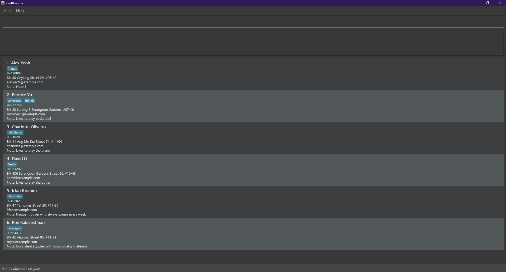
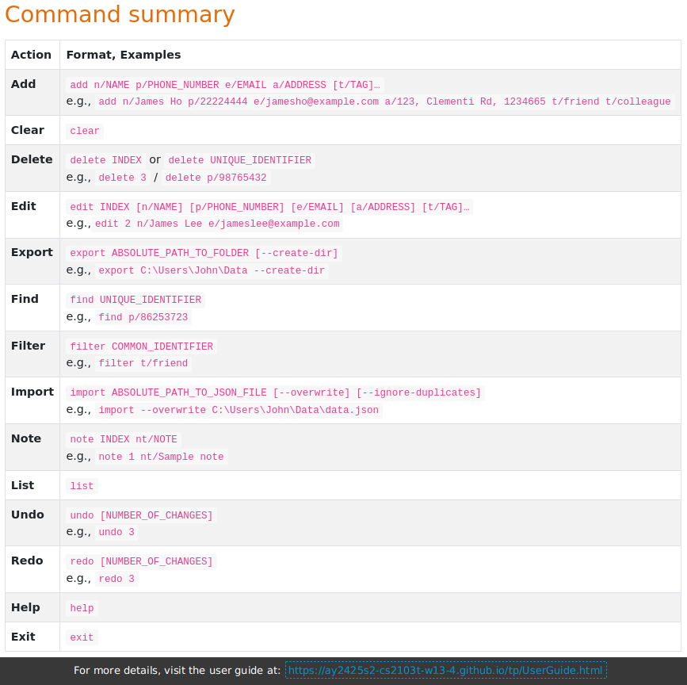
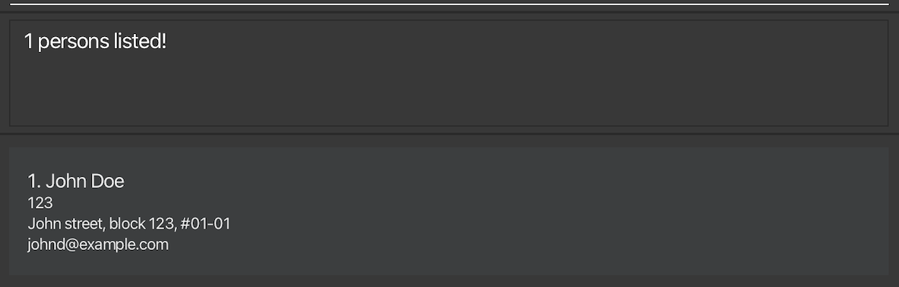

# CraftConnect User Guide

CraftConnect is a simple desktop app that makes managing your contacts **faster and easier**. Our target audience is small business owners, especially in the arts and crafts sector, but you can try it out even if you are not a business owner in this sector. It combines the quick typing of a command-line tool with the familiar look of a regular app. Whether you’re keeping track of suppliers or customers, CraftConnect helps you stay organized and get things done in less time.

<!-- * Table of Contents -->
<page-nav-print />

--------------------------------------------------------------------------------------------------------------------
## Quick start

1. Ensure you have Java `17` or above installed in your Computer.<br>
   **Mac users:** Ensure you have the precise JDK version prescribed [here](https://se-education.org/guides/tutorials/javaInstallationMac.html).<br>
   To check for Java installation, open a command terminal and type `java -version`. You should see a message indicating the version of Java installed. If you do not see this message, please install Java from [here](https://www.oracle.com/java/technologies/javase-jdk17-downloads.html).

2. Download the latest `.jar` file from [here](https://github.com/se-edu/addressbook-level3/releases).

3. Copy the file to the folder you want to use as the _home folder_ for your AddressBook.

4. Open a command terminal, `cd` into the folder you put the jar file in, and use the `java -jar craftconnect.jar` command to run the application.<br>
   For example, if you put your `craftconnect.jar` file in a folder with path
   ```shell
    C:/Users/DummyUser/Documents
   ```
   Then, you open the command terminal and do:
   ```shell
   cd "C:/Users/DummyUser/Documents"
   java -jar craftconnect.jar
   ```
   
   A GUI similar to the below should appear in a few seconds. Note how the app contains some sample data.<br>
   

5. Type the command in the command box and press Enter to execute it. e.g. typing **`help`** and pressing Enter will open the help window.<br>
   Some example commands you can try:

   * `list` : Lists all contacts.

   * `add n/John Doe p/98765432 e/johnd@example.com a/John street, block 123, #01-01` : Adds a contact named `John Doe` to the address book.

   * `filter n/John Doe` : Filters all contacts with the name `John Doe`.

   * `find p/98765432` : Finds the contact with the phone number `98765432`.

   * `delete 3` : Deletes the 3rd contact shown in the current list.

   * `clear` : Deletes all contacts.

   * `undo` : Revert a change you accidentally did to the address book.

   * `exit` : Exits the app.

6. Refer to the [Features](#features) below for details of each command.

--------------------------------------------------------------------------------------------------------------------

## Features

<box type="info" seamless>

**Notes about the command format:**<br>

* Our commands do not support `/` for any of the parameters. For example, if your name is `John s/o Doe`, you should enter it as `John so Doe` instead of `John s/o Doe`. This is because `/` breaks the command format and causes the command to fail.

* Command words are case-sensitive. Make sure to follow exactly as given in this guide,<br>
  e.g. `add` is correct but `Add` or `ADD` will not work.

* Words in `UPPER_CASE` are the parameters to be supplied by the user.<br>
  e.g. in `add n/NAME`, `NAME` is a parameter which can be used as `add n/John Doe`.

* Items in square brackets are optional.<br>
  e.g. `n/NAME [t/TAG]` can be used as `n/John Doe t/friend` or as `n/John Doe`.

* Items with `…`​ after them can be used multiple times including zero times.<br>
  e.g. `[t/TAG]…​` can be used as ` ` (i.e. 0 times), `t/friend`, `t/friend t/family` etc.

* Parameters can be in any order.<br>
  e.g. if the command specifies `n/NAME p/PHONE_NUMBER`, `p/PHONE_NUMBER n/NAME` is also acceptable.

* Extraneous parameters for commands that do not take in parameters (such as `help`, `list`, `exit` and `clear`) will be ignored.<br>
  e.g. if the command specifies `help 123`, it will be interpreted as `help`.

* If you are using a PDF version of this document, be careful when copying and pasting commands that span multiple lines as space characters surrounding line-breaks may be omitted when copied over to the application.
</box>

### Contact attributes
* **`UNIQUE_IDENTIFIER`** - At any point in time, no two contacts should have the same of this attribute. Some features only work for unique identifiers.
* **`COMMON_ATTRIBUTE`** - More than one contact can have the same value for this attribute. Some features only work for common attributes.
* **`OPTIONAL`** - A contact does not necessarily contain this attribute.
* **`COMPULSORY`** - At any point in time, a contact must contain this attribute.

| Attribute | Prefix | Description                                                                                                                                                                                                                                                                                                                                                                                                                                                                                                                                                                                                                                                                                                                                                                                                           |
|-----------|--------|-----------------------------------------------------------------------------------------------------------------------------------------------------------------------------------------------------------------------------------------------------------------------------------------------------------------------------------------------------------------------------------------------------------------------------------------------------------------------------------------------------------------------------------------------------------------------------------------------------------------------------------------------------------------------------------------------------------------------------------------------------------------------------------------------------------------------|
| NAME      | `n/`   | A contact's name. Can only contain alphanumeric characters and spaces, and have between 1 and 100 characters.<br>>> **`COMMON_ATTRIBUTE`**<br>>> **`COMPULSORY`**                                                                                                                                                                                                                                                                                                                                                                                                                                                                                                                                                                                                                                                     |
| EMAIL     | `e/`   | A contact's email address. Must be a valid email address format (local-part@domain-part, maximum 253 characters). CraftConnect will not check if the email exists.<br>>> **`UNIQUE_IDENTIFIER`**<br>>> **`COMPULSORY`**                                                                                                                                                                                                                                                                                                                                                                                                                                                                                                                                                                                               | 
| PHONE     | `p/`   | A contact's phone number. This is a unique attribute, meaning that no two contacts should share the same phone number. Must contain between 3 and 15 digits, with no spaces or other characters. CraftConnect will not check if the phone number exists.<br>>> **`UNIQUE_IDENTIFIER`**<br>>> **`COMPULSORY`**                                                                                                                                                                                                                                                                                                                                                                                                                                                                                                         |
| ADDRESS   | `a/`   | A contact's physical address, must be between 1 and 255 characters. CraftConnect will not check if the physical address exists.<br>>> **`COMMON_ATTRIBUTE`**<br>>> **`COMPULSORY`**                                                                                                                                                                                                                                                                                                                                                                                                                                                                                                                                                                                                                                   |
| TAG       | `t/`   | A contact's tag. A contact may have more than one tag, where each tag can only contain alphanumeric characters and spaces, and have between 1 and 50 characters.<br>>> **`COMMON_ATTRIBUTE`**<br>>> **`OPTIONAL`**                                                                                                                                                                                                                                                                                                                                                                                                                                                                                                                                                                                                    |
| NOTE      | `nt/`  | A piece of note corresponding to this contact, must be between 1 and 255 characters.<br>>> **`COMMON_ATTRIBUTE`**<br>>> **`OPTIONAL`**                                                                                                                                                                                                                                                                                                                                                                                                                                                                                                                                                                                                                                                                                |
| INDEX     | NA     | A number uniquely assigned to a contact every time the contact list is shown, starting from 1, increasing by 1 for each contact.<br><br>For every operation (`add`, `delete`, `filter`, `find`) that causes a change to the displayed list, each contact in this new list will be assigned to a new index, such that the index still starts at 1 and increases by 1 for each contact.<br><br>For operations that involve indexes, the index must range between 1 and the maximum number of contacts.<br><br>For example, CraftConnect contains 10 contacts, where contacts 1, 3, 5, 7, 9 have names containing the letter 'e'. After filtering all contacts whose names contain the letter 'e', the indexes are reset to 1 to 5 and reassigned to the filtered contacts, instead of displaying 1, 3, 5, 7, 9.<br><br> |


### Viewing help : `help`

Shows a summary of all available messages, as well as a link to access this User Guide.

Format: `help`



### Adding a contact: `add`

Adds a contact to the address book.

Format: `add n/NAME p/PHONE_NUMBER e/EMAIL a/ADDRESS [t/CATEGORY]…​`

Examples:
* `add n/John Doe p/98765432 e/johnd@example.com a/John street, block 123, #01-01`
* `add n/Betsy Crowe t/friend e/betsycrowe@example.com a/Newgate Prison p/1234567 t/supplier`

### Listing all contacts : `list`

Shows a list of all contacts in the address book.

Format: `list`

### Editing a contact : `edit`

Edits an existing contact in the address book.

Format: `edit INDEX [n/NAME] [p/PHONE] [e/EMAIL] [a/ADDRESS] [t/TAG]…​`

<box type="tip" seamless>

**Tip:** You can remove all the contact’s tags by typing `t/` without specifying any tags after it.
</box>

* At least one of the optional fields must be provided. Edit command must contain at least 1 attribute that is changed to be successful.
* Existing values will be updated to the input values.
* When editing tags, the existing tags of the contact will be removed i.e. adding of tags is not cumulative.

Examples:
*  `edit 1 p/91234567 e/johndoe@example.com` Edits the phone number and email address of the 1st contact to be `91234567` and `johndoe@example.com` respectively.
*  `edit 2 n/Betsy Crower t/` Edits the name of the 2nd contact to be `Betsy Crower` and clears all existing tags.

### Locating contacts by unique identifier: `find`

Finds contacts by searching for a unique attribute

Format: `find UNIQUE_IDENTIFIER`

* Only 1 unique identifier can be inputted at a time.
* This search will always return at most 1 person when a valid attribute is provided.
* The inputs are case-insensitive e.g. `JOHN` will match `john`.
* Only full words or numbers will be matched e.g. `123` will not match `1234`.

Examples:
* `find p/123` returns the contact with the phone number `123`
* `find e/johnd@example.com` returns the contact with the email `johnd@example.com`
  

### Filtering contacts by common identifier: `filter`

Filters contacts by searching for a common attribute.

Format: `filter COMMON_ATTRIBUTE`

* Only 1 common identifier and 1 common identifier TYPE can be inputted at a time.
* Filter by notes are not supported, please stick to names, addresses and tags for now.
* This search will return all contacts within the user's entire contact list that exactly or approximately match the common attribute provided.
* The inputs are case-insensitive e.g. `JOHN` will match `john`.


Searching by `NAME` allows for one misspelled or missing letter in each part of the name i.e. surname, last name.
If the `NAME` inputted is more than 1 word, contacts that only match part of the `NAME` and are not similar enough will not be listed. 

Examples:
* `filter n/Alex` can return contacts with names `Alec` and `Alex Yeoh` but not `David`
* `filter n/Alex Yeoh` can return contacts with names `Alec Yeoh` and `Alex Marvin Yeoh`, but not `Alex Tan` and `Marvin Yeoh`


Searching by `ADDRESS` allows for two misspelled or missing letters in each part of the address, except for numeric parts (e.g. block number), which must be exact. Unit number is exempted from this exception.
Contacts that only match part of the `ADDRESS` inputted will not be listed and are not similar enough.

Examples:
* `filter a/Blk 123 Geylang St 31` can return contacts with address `Blk 123 Geylang St 31, #06-30` and `Blk 123 Geylang St 31, #06-41` but not `Blk 123 Geylang St 30, #06-31`
* `filter a/Blk 123 Geylang St 31 #06-40` can return contacts with address `Blk 123 Geylang St 31, #06-30` but not `Blk 123 Geylang St 31` and `Blk 123 Lorong St 31,`

Searching by `TAG` allows for two misspelled or missing letters in each part of the tag. 
If the `TAG` inputted is more than 1 word, contacts that only match part of the `TAG` and are not similar enough will not be listed.

Examples:
* `filter t/supplier` can return contacts with the tag `supplier` and `paint supplier`
* `filter t/paint supplier` can return contacts with the tag `acrylic paint supplier` but not those with the tag `paper supplier`

### Deleting a contact : `delete`

Deletes the specified contact from the address book.

Format: `delete UNIQUE_IDENTIFIER` or `delete INDEX`

* Only 1 unique identifier can be inputted at a time.
* A valid email or phone number will delete the corresponding contact regardless of any applied filters.

Examples:
* `list` followed by `delete 2` deletes the 2nd contact in the address book.
* `filter n/Betsy` followed by `delete 1` deletes the 1st contact in the results of the `filter` command.
* `delete p/1234567` deletes the contact with the phone number `1234567` (even if not shown in current list).

### Adding a note to a contact : `note`

Changes the note of an existing contact in the list. When a contact is added into the address book, the contact will
have an empty note.

Format: `note INDEX nt/NOTE`

<box type="tip" seamless>

**Tip:** To clear the current note of a contact, just use `note INDEX nt/`
</box>

* Adding a new contact will create a contact with an empty note.
* Note that the note command is not cumulative and will overwrite the existing note.

Examples:
* `list` followed by `note 2 nt/Sample note` will overwrite the note of the 2nd contact in the address book to be "Sample note"
* filter `n/john` followed by `note 3 nt/Sample note` will overwrite the note of the 3rd contact in the filtered contacts list to be "Sample note"

### Export data : `export`

Exports the current contacts from CraftConnect into a JSON file named `craftconnect.json`, 
and puts the file into a folder whose absolute path is specified.

**NOTE**: Before you attempt to alter the data file after export, please refer to [Editing the data file](#editing-the-data-file) section.

**NOTE**: We do not enforce any restriction on the maximum number of characters for paths because this is OS-dependent. 
However, know that OSes will silently truncate long path names (Windows is about 260, Linux is 4096). Please limit 
the path length accordingly.

Format: `export ABSOLUTE_PATH_TO_FOLDER [--create-dir]`

- The absolute path refers to the full location of the file starting from the root of the system, for example,
  - `C:\Users\JohnDoe\Documents\Data` (Windows)
  - `/home/johndoe/Documents/Data` (Linux)
- When the path to the folder contains spaces, do not include quotation marks. Leave the path as it is.
- When there is no folder at the specified path, the `-–create-dir` flag will tell CraftConnect to create that folder 
before inserting the JSON file into it. If the flag is not specified, there **must be** an existing folder at that path.
- The -–create-dir flag can be put anywhere after the export command, so
  - `export -–create-dir C:\Users\John\Data`
  - `export C:\Users\John\Data -–create-dir`

  are all valid commands.
- It is highly recommended to use an absolute path to ensure that the correct file is imported. 
Using a relative path (e.g. `Documents/Data/`) may cause unexpected behaviour because the system would not 
know your current location.
- If the following conditions are met:
  - There is an existing folder, for example `C:\Users\John\Data`
  - There does not exist a specific file within that folder, for example `C:\Users\John\Data\data.json`
  - An accidental call to import with the path to that file
  - The `-–create-dir` flag is enabled, for example, `export C:\Users\John\Data\data.json –-create-dir`.
  
  Then, CraftConnect will create the new folder, for example with name `data.json`, and put the exported data file 
  into this folder, resulting in the data file being located in `C:\Users\John\Data\data.json\craftconnect.json`. 
  This is to allow for folder names that contain the ‘.’ character.
- Accidentally calling export with a path to an existing file will return an error.

Examples
- `export C:\Users\John\Data` will export all data into a file located at `C:\Users\John\Data\craftconnect.json` if the 
folder exists, and returns an error otherwise.
- `export C:\Users\John\My Data –-create-dir` will create a new folder located at `C:\Users\John\My Data` if the folder 
has not existed, and export all data into a file located at `C:\Users\John\Data\craftconnect.json`.

### Import data : `import`

Imports new data from a JSON file in the specified path into CraftConnect.

**NOTE**: Before you attempt to alter the data file before import, please refer to [Editing the data file](#editing-the-data-file) section.

**NOTE**: We do not enforce any restriction on the maximum number of characters for paths because this is OS-dependent.
However, know that OSes will silently truncate long path names (Windows is about 260, Linux is 4096). Please limit
the path length accordingly.

Format: `import ABSOLUTE_PATH_TO_JSON_FILE [--overwrite] [--ignore-duplicates]`

- Duplicated contacts are contacts with at least 1 identical unique identifier, such as two contacts with the same phone
number, or two contacts with the same email address.
- The absolute path refers to the full location of the file starting from the root of the system, for example,
  - `C:\Users\JohnDoe\Documents\Data\addressbook.json` (Windows)
  - `/home/johndoe/Documents/Data/addressbook.json` (Linux)
- When the path to the file contains spaces, do not include quotation marks. Leave the path as it is.
- It is highly recommended to use an absolute path to ensure that the correct file is imported. 
Using a relative path (e.g. `Documents/Data/addressbook.json`) may cause unexpected behaviour because the system would 
not know your current location.
- The optional `--overwrite` flag tells CraftConnect to overwrite existing contacts with new data from the JSON file. 
By default, CraftConnect will add new contacts on top of the existing contacts.
- The optional `--ignore-duplicate` flag tells CraftConnect to ignore duplicated contacts when adding new contacts. 
By default, if there are duplicated contacts within the JSON file, or a contact in the JSON file is a duplicate of an 
existing contact, CraftConnect will display an error message related to duplicated contacts. For example, there are two
contacts with the same phone number or email address. The first contact will be added to CraftConnect. If 
`--ignore-duplicates` are specified, the second contact is not added to CraftConnect, otherwise, there will be an error
message about duplicated contacts.
- Flags can be put anywhere after the `import` command, that is:
  - `import --overwrite --ignore-duplicates C:/Users/Dummy/data.json`
  - `import --overwrite C:/Users/Dummy/data.json --ignore-duplicates`
  - `import C:/Users/Dummy/data.json --overwrite --ignore-duplicates`
  - `import --ignore-duplicates --overwrite C:/Users/Dummy/data.json`
  - `import --ignore-duplicates C:/Users/Dummy/data.json --overwrite`
  - `import C:/Users/Dummy/data.json --ignore-duplicates --overwrite`
  - `import --overwrite C:/Users/Dummy/data.json`
  - `import C:/Users/Dummy/data.json --overwrite`
  - `import --ignore-duplicates C:/Users/Dummy/data.json`
  - `import C:/Users/Dummy/data.json --ignore-duplicates`
  
  are all valid commands.
- The file to be imported must exist, have the `.json` extension, and follow the data schema of CraftConnect. 
It is best for non-technical users to pair the `import` functionality with `export`, to carry data from one 
CraftConnect address book to another CraftConnect address book.
- In the current version, if the `--overwrite` flag is specified, and there is any problem with the data file such as 
  - the file is empty
  - the file content does not conform to the JSON schema of CraftConnect
  - contains duplicated contacts

  a generic error message that lumps all of these problems into one will be displayed. We will make errors more specific for this case in future versions.

Examples

**Disclaimer**: This is not how data is represented in CraftConnect, but it works as an illustration.

Consider a CraftConnect address book with two people:
```
1. Alice, with phone number 98765432
2. Ben, with phone number 12345678
```

And the `C:\Users\JohnDoe\Documents\My Data\addressbook.json` file contains
```
1. Cheryl, with phone number 97867564
2. Daniel, with phone number 12345678
```

See that Ben and Daniel have the same contacts, so they are considered duplicated contacts.

- `import C:\Users\JohnDoe\Documents\My Data\addressbook.json` will add new contacts on top of the current contacts in 
CraftConnect with new data from the given JSON file.\
=> **Result**: 
```
Error: Duplicated entries
```
- `import --overwrite C:\Users\JohnDoe\Documents\My Data\addressbook.json` will replace the current contacts in
CraftConnect with new data from the given JSON file.
  => **Result**: CraftConnect will now contain
```
1. Cheryl, with phone number 97867564
2. Daniel, with phone number 12345678
```
- `import --ignore-duplicates C:\Users\JohnDoe\Documents\My Data\addressbook.json` will add new contacts on top of the 
current contacts in CraftConnect with new data from the given JSON file, and will ignore duplicated contacts 
(except the first one added).
  => **Result**: CraftConnect will now contain
```
1. Alice, with phone number 98765432
2. Ben, with phone number 12345678
3. Cheryl, with phone number 97867564
```
- `import --overwrite --ignore-duplicates C:\Users\JohnDoe\Documents\My Data\addressbook.json` will replace
current contacts in CraftConnect with new data from the given JSON file, and will ignore duplicated contacts 
(except the first one added).
  => **Result**: CraftConnect will now contain
```
1. Cheryl, with phone number 97867564
2. Daniel, with phone number 12345678
```

### Reverting changes to the address book : `undo`

Reverts the latest one or more changes to the address book.

Format: `undo [NUMBER_OF_CHANGES]`

Parameter:

- `NUMBER_OF_CHANGES`: The number of changes to revert. Must be a positive integer.
If not supplied, defaults to `1`.

Example: `undo`, `undo 3`


### Restoring changes to the address book : `redo`

Restores the latest one or more changes to the address book that were reverted by `undo`.

Format: `redo [NUMBER_OF_CHANGES]`

Parameter:

- `NUMBER_OF_CHANGES`: The number of changes to restore. Must be a positive integer.
If not supplied, defaults to `1`.

Example: `redo`, `redo 3`

### Clearing all entries : `clear`

Clears all entries from the address book.

Format: `clear`

### Exiting the program : `exit`

Exits the program.

Format: `exit`

### Saving the data

AddressBook data are saved in the hard disk automatically after any command that changes the data. There is no need to save manually.

### Editing the data file

AddressBook data is saved automatically as a JSON file `[JAR file location]/data/addressbook.json`. Advanced users are welcome to update data directly by editing that data file, but in fact, 
it is safest to not edit it manually at all. Facilitate any data modification and transfer using commands.

If your changes to the data file makes its format invalid, AddressBook will discard all data and start with an empty data file at the next run.  Hence, it is recommended to take a backup of the file before editing it.<br>

Furthermore, certain edits can cause the AddressBook to behave in unexpected ways (e.g., if a value entered is outside the acceptable range). Therefore, edit the data file only if you are confident that you can update it correctly.

### Archiving data files `[coming in v2.0]`

_Details coming soon ..._

--------------------------------------------------------------------------------------------------------------------

## FAQ

**Q**: How do I transfer my data to another Computer?<br>
**A**: Assume you transfer data from *Computer A* to *Computer B*,
1. Use the `export` command to export the contacts in *Computer A* to a JSON file.
2. Install CraftConnect in *Computer B*.
3. Copy the JSON file from *Computer A* to *Computer B*.
4. In *Computer B*, use the `import` command to transfer the data from the JSON file to the CraftConnect address book 
in this computer.

--------------------------------------------------------------------------------------------------------------------

## Known issues

1. **When using multiple screens**, if you move the application to a secondary screen, and later switch to using only the primary screen, the GUI will open off-screen. The remedy is to delete the `preferences.json` file created by the application before running the application again.
2. **If you minimize the Help Window** and then run the `help` command (or use the `Help` menu, or the keyboard shortcut `F1`) again, the original Help Window will remain minimized, and no new Help Window will appear. The remedy is to manually restore the minimized Help Window.

--------------------------------------------------------------------------------------------------------------------

## Command summary
| Action     | Format, Examples                                                                                                                                                      |
|------------|-----------------------------------------------------------------------------------------------------------------------------------------------------------------------|
| **Add**    | `add n/NAME p/PHONE_NUMBER e/EMAIL a/ADDRESS [t/TAG]…​` <br> e.g., `add n/James Ho p/22224444 e/jamesho@example.com a/123, Clementi Rd, 1234665 t/friend t/colleague` |
| **Clear**  | `clear`                                                                                                                                                               |
| **Delete** | `delete INDEX` or `delete UNIQUE_IDENTIFIER`<br> e.g., `delete 3` / `delete p/98765432`                                                                               |                                                                                                  
| **Edit**   | `edit INDEX [n/NAME] [p/PHONE_NUMBER] [e/EMAIL] [a/ADDRESS] [t/TAG]…​`<br> e.g.,`edit 2 n/James Lee e/jameslee@example.com`                                           |                                          
| **Export** | `export ABSOLUTE_PATH_TO_FOLDER [--create-dir]` <br> e.g., `export C:\Users\John\Data --create-dir`                                                                   |                                      
| **Find**   | `find UNIQUE_IDENTIFIER`<br> e.g., `find p/86253723`                                                                                                                  |                                     
| **Filter** | `filter COMMON_IDENTIFIER`<br> e.g., `filter t/friend`                                                                                                                |                                    
| **Import** | `import ABSOLUTE_PATH_TO_JSON_FILE [--overwrite] [--ignore-duplicates]` <br> e.g., `import --overwrite C:\Users\John\Data\data.json`                                  |                                   
| **Note**   | `note INDEX nt/NOTE`<br> e.g., `note 1 nt/Sample note`                                                                                                                |
| **List**   | `list`                                                                                                                                                                |
| **Undo**   | `undo [NUMBER_OF_CHANGES]`<br> e.g., `undo 3`                                                                                                                         | 
| **Redo**   | `redo [NUMBER_OF_CHANGES]`<br> e.g., `redo 3`                                                                                                                         |  
| **Help**   | `help`                                                                                                                                                                |                                 
